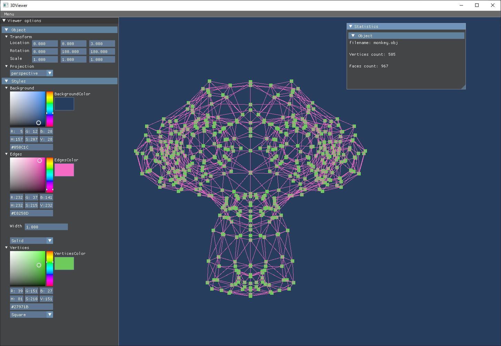

# Обозреватель 3D моделей на C++ & Vulkan API

## Учебный проект от Школы 21 (Сбер)

**Доступна только Windows x64 версия**

Проект выполнен следуя стандартам паттерна [MVC](https://ru.wikipedia.org/wiki/Model-View-Controller) и [Google C++ Style Guide](https://google.github.io/styleguide/cppguide.html). Для создания окна используется **GLFW3**, для пользовательского интерфейса - **ImGUI**. Рендер 3D моделей происходит через **Vulkan API**. Для открытия **документации** проекта должна быть установлена утилита docsify, если этот пункт соблюдён, то воспользуйтесь командой ``make dvi`` в ``src/`` директории проекта.
