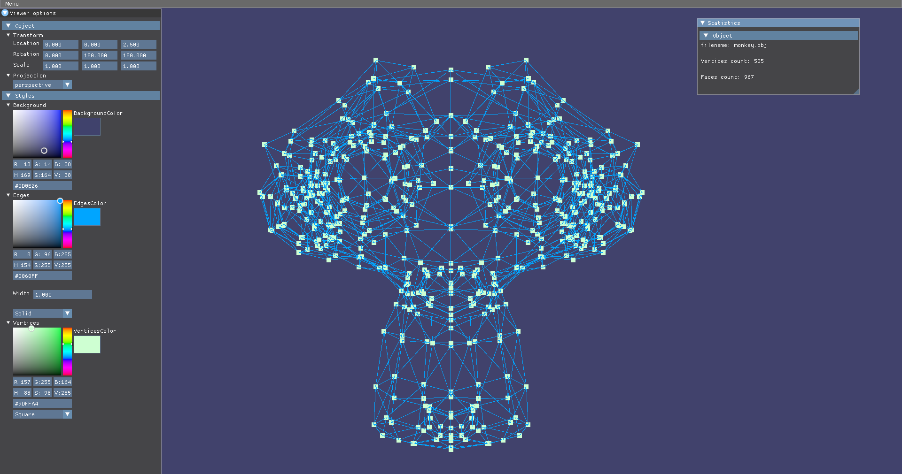

# 3D models viewer in .obj format

## Made with C++, Vulkan, GLFW, ImGUI, glm

## Documentation

If you have [docsify](https://github.com/docsifyjs/docsify) installed then go to ``src/`` and call the ``make dvi`` target.
Otherwise go to ``materials/docs`` and open the .md file.

### ONLY WINDOWSx64 VERISON AVAILABLE
