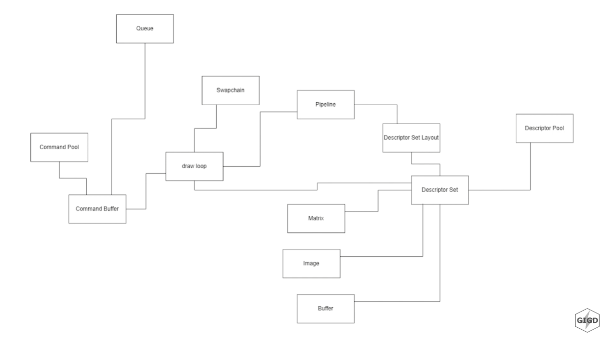

# 3DViewer_v2.0

> russian version only.

## Информация об Vulkan

### Основные комоненты

Для создания приложения на Vulkan необходимо создать объект класса Vulkan - VkInstance. Он содержит в себе информацию о логическом и физическом устройстве. Физическим устройством является любой видео-графический компонент в ПК, например внешняя или встроенная видеокарта. Логическое устройство это надстройка над физическим устройством и его драйвером.Устройство содержит в себе очереди команд, **графическую** для отрисовки, **вычислиельную** для математических операций, **трансферную** для случаев, когда надо перенести изображение с CPU на GPU и наоборот.

### Работа с окном

Vulkan API не умет сам напрямую общаться с окном, поэтому нужно встраивать его в существующее окно, созданное другой библиотекой (пример с **glfw**: ``S21Window::createWindowSurface``). **Swapchain** отвечает за двойную/тройную буферизацию, **View** в Image является протоколом доступа памяти изображения.

### Графический конвейер

Для Vulkan API небходимо явно указывать, в какой последовательности и по каким правилам необходимо отрисовывать изображение. За это отвечают файлы ``src/pipeline.*``. Шейдеры **Spir-V** это оболочка над glsl (Шейдеры OpenGL).

### Цикл рендеринга

В конце концов в цикл рендера попадают команды, которые выгружаются из очередей, набор ссылок на матрицы, шейдеры и изображения, полученные в результате прохода по графическому конвейеру.

## Сборка программы

### Библиотеки

Для сборки необходимы библиотеки [Vulkan SDK](https://vulkan.lunarg.com/sdk/home#windows "Vulkan API"), [GLFW-3 x64](https://www.glfw.org/download.html "GLFW") для работы с окнами, [GLM](https://github.com/g-truc/glm/releases/ "GLM") для математических вычислений и [ImGui](https://github.com/ocornut/imgui/releases/ "ImGui") для рисования пользовательского интерфейса.

### Процесс сборки

В директорию проекта ``src/libraries/`` необходимо добавить исходники библиотеки **glfw-3** (glfw-3.3.8.bin.WIN64) и **glm**. В директории проекта ``src/tests/`` должна быть добавлена папка **packages** - это стандартная папка от Visual Studio, которая генерируется при создании Google Test проекта.

## Архитектура программы

### S21Root

Объявления всех важных компонентов для работы приложения.

### S21Application

Главный класс программы, вызывает и компанует все методы для получения итогового результата.

### S21Camera

Содержит матрицы проекций (перспективная и ортогональная).

### S21Device

Создаёт физическое и логическое устройство, реализует очереди и пул комманд.

### S21InputController [legacy]

Реализует возможность перемещать камеру через ивенты нажатий по клавиатуре.

### S21Model

Инкапсулирует парсер .obj файла, содержит буфферы точек и индексов.

### S21Object

Икапсулирует S21Model, содержит ифнормацию о трансфорации модели в структуре TransformComponent.

### S21Pipeline

Реализует два графических пайплайна, для отображения самой модели и отображения точек.

### S21RenderSystem

Инкапсулирует в себе пайплайны, занимается отрисовкой объектов.

### S21RendererComponent

Работает с ранее созданным Swapchain (пересоздаёт его) для выполнения ресайза окна.

### S21SwapChain

Реализует функционал стандартного Swapchain, хранит изображения двойной буфферизации.

### S21Utils

Реализует статические методы хелперы для других классов.

### S21UtilsController

Контроллер от MVC для связи с S21Utils.

### S21View

Отрисовывает интерфейс на основе библиотеки ImGui.

### S21Window

Реализует окно от бибилотеки glfw, связывает созданное окно с Vulkan.
